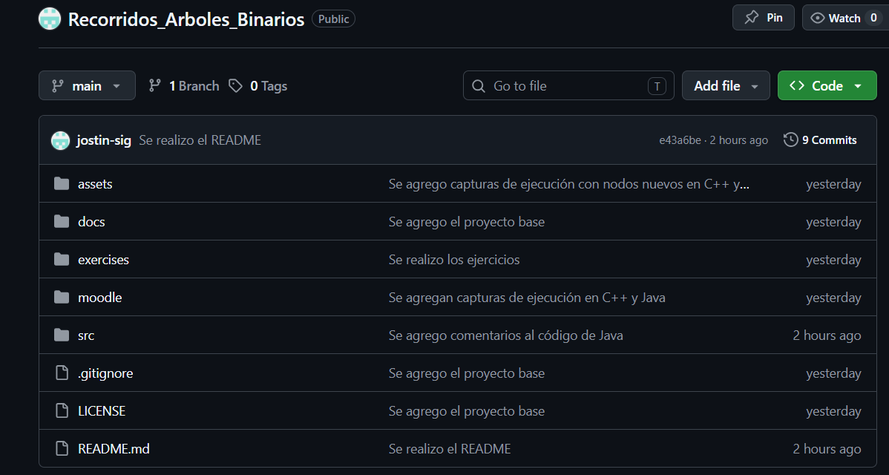
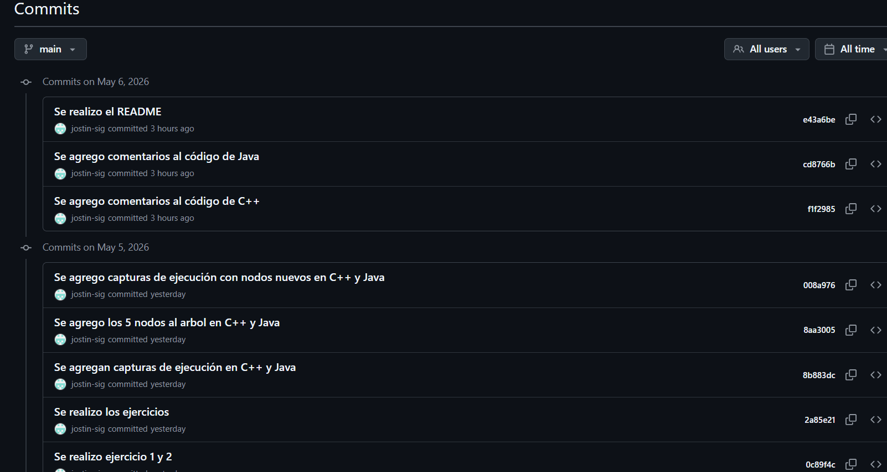
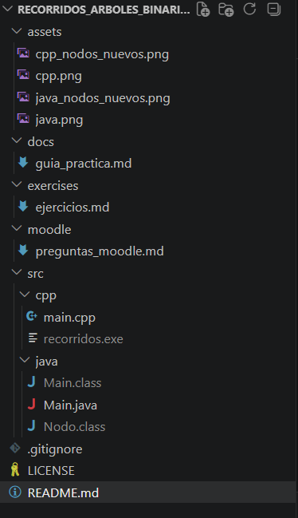
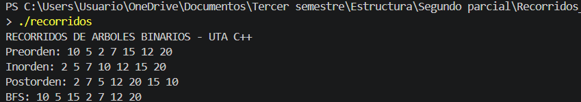
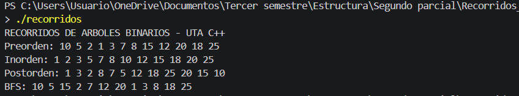
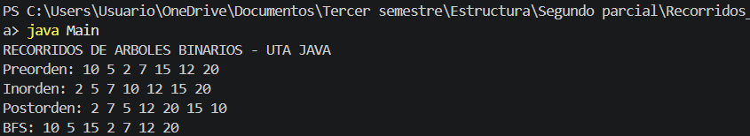
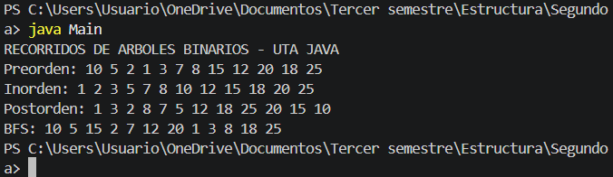

# Recorridos de Árboles Binarios - Estructura de Datos

**Universidad Técnica de Ambato**  
**Carrera:** Ingeniería de Software  
**Asignatura:** Estructura de Datos  
**Curso:** Tercero B  
**Tema:** Recorridos de árboles binarios: Inorden, Preorden, Postorden y BFS

---

## Integrante

- Sigcha Arcos Justin Israel

---

## Introducción

Los árboles binarios son estructuras de datos jerárquicas utilizadas para organizar información de manera eficiente.

En esta práctica se implementaron los recorridos Inorden, Preorden, Postorden y BFS utilizando C++ y Java, aplicando recursividad y colas dinámicas.

---

## Objetivo general
Implementar y analizar los principales recorridos de árboles binarios utilizando C++ y Java, aplicando estructuras de datos dinámicas, recursividad y colas.

---

## Resultados de aprendizaje
Al finalizar la práctica, el estudiante será capaz de:

1. Explicar la diferencia entre recorridos DFS y BFS.
2. Implementar recorridos Inorden, Preorden y Postorden con recursividad.
3. Implementar BFS usando una cola.
4. Comparar la implementación en C++ y Java.
5. Aplicar recorridos de árboles a un caso real del proyecto final.

---

## Contenido

| Carpeta | Descripción |
|---|---|
| `docs/` | Guía práctica para la clase |
| `src/cpp/` | Implementación completa en C++ |
| `src/java/` | Implementación completa en Java |
| `exercises/` | Ejercicios para trabajo grupal |
| `moodle/` | Banco de preguntas tipo Moodle |
| `assets/` | Recursos de apoyo |

---

## Creación del Repositorio
Se creó exitosamente el repositorio público Recorridos_Arboles_Binarios en la plataforma GitHub. 



---

# Historial de commits
Se realizaron commits progresivos que evidencian el desarrollo por etapas del proyecto



---

# Estructura del proyecto
Esta estructura permitió mantener orden entre código



---


## Estructura del árbol implementado
 
```
            10
           /  \
          5    15
         / \   / \
        2   7 12  20
       / \  \    /  \
      1   3  8  18   25
```
Nodos base: 10, 5, 15, 2, 7, 12, 20  
Nodos nuevos agregados: 1, 3, 8, 18, 25

---

## Reglas de recorrido

| Recorrido | Orden | Resultados obtenidos|
|---|---|---|
| Preorden | Izquierda → Raíz → Derecha | 10 5 2 1 3 7 8 15 12 20 18 25 |
| Inorden | Raíz → Izquierda → Derecha |  1 2 3 5 7 8 10 12 15 18 20 25 |
| Postorden | Izquierda → Derecha → Raíz | 1 3 2 8 7 5 12 18 25 20 15 10 |
| BFS | Nivel por nivel usando cola | 10 5 15 2 7 12 20 1 3 8 18 25 |

---

## Ejecución en C++

```bash
cd src/cpp
g++ main.cpp -o recorridos
./recorridos
```

## Ejecución en Java

```bash
cd src/java
javac Main.java
java Main
```

---
 
## Capturas de ejecución
 
### C++


Agremos los 5 nodos nuevos


 
### Java


Agregamos los 5 nodos nuevos


 
---
 
## Comparación C++ vs Java
 
| Aspecto | C++ | Java |
|---|---|---|
| Punteros | Usa `Nodo*` con punteros | Usa referencias de objeto |
| Nulo | `nullptr` | `null` |
| Cola BFS | `queue<Nodo*>` de `<queue>` | `Queue<Nodo>` de `java.util` |
| Salida en consola | `cout <<` | `System.out.print()` |
| Resultado de recorridos | Idéntico | Idéntico |
 
**Conclusión de la comparación:** Ambos lenguajes producen exactamente el mismo resultado en los cuatro recorridos. La diferencia principal está en la sintaxis: C++ usa punteros y memoria manual mientras que Java usa referencias y gestión automática de memoria.
 
---
 
## Caso aplicado — Sistema Web
 
```
            Sistema Web
           /           \
     Usuarios        Inventario
      /    \          /      \
 Registrar Buscar  Productos Reportes
```
 
| Necesidad | Recorrido recomendado | Razón |
|---|---|---|
| Mostrar el menú principal | Preorden | Muestra primero la raíz (Sistema Web) antes que los submenús |
| Procesar módulos internos primero | Postorden | Procesa los hijos (Registrar, Buscar) antes que el padre (Usuarios) |
| Mostrar módulos nivel por nivel | BFS | Recorre nivel a nivel: Sistema Web → Usuarios e Inventario → módulos hoja |
 
---

## Ejercicios resueltos
 
### Ejercicio 1 — Recorridos del árbol base
 
Árbol:
```
        10
       /  \
      5    15
     / \   / \
    2   7 12  20
```
 
| Recorrido | Resultado |
|---|---|
| Preorden | 10 5 2 7 15 12 20 |
| Inorden | 2 5 7 10 12 15 20 |
| Postorden | 2 7 5 12 20 15 10 |
| BFS | 10 5 15 2 7 12 20 |
 
### Ejercicio 2 — Árbol con nodos nuevos (1, 3, 8, 18, 25)
 
Árbol actualizado:
```
            10
           /  \
          5    15
         / \   / \
        2   7 12  20
       / \  \    /  \
      1   3  8  18   25
```
 
| Recorrido | Resultado |
|---|---|
| Preorden | 10 5 2 1 3 7 8 15 12 20 18 25 |
| Inorden | 1 2 3 5 7 8 10 12 15 18 20 25 |
| Postorden | 1 3 2 8 7 5 12 18 25 20 15 10 |
| BFS | 10 5 15 2 7 12 20 1 3 8 18 25 |
 
### Ejercicio 3 — Función contar nodos
 
```cpp
// C++
int contarNodos(Nodo* raiz) {
    if (raiz == nullptr) return 0;
    return 1 + contarNodos(raiz->izquierda) + contarNodos(raiz->derecha);
}
```
 
```java
// Java
public static int contarNodos(Nodo raiz) {
    if (raiz == null) return 0;
    return 1 + contarNodos(raiz.izquierda) + contarNodos(raiz.derecha);
}
```
 
Resultado con árbol base: **7 nodos**  
Resultado con nodos nuevos: **12 nodos**
 
### Ejercicio 4 — Función contar hojas
 
```cpp
// C++
int contarHojas(Nodo* raiz) {
    if (raiz == nullptr) return 0;
    if (raiz->izquierda == nullptr && raiz->derecha == nullptr) return 1;
    return contarHojas(raiz->izquierda) + contarHojas(raiz->derecha);
}
```
 
```java
// Java
public static int contarHojas(Nodo raiz) {
    if (raiz == null) return 0;
    if (raiz.izquierda == null && raiz.derecha == null) return 1;
    return contarHojas(raiz.izquierda) + contarHojas(raiz.derecha);
}
```
 
Resultado con árbol base: **4 hojas** (nodos 2, 7, 12, 20)  
Resultado con nodos nuevos: **6 hojas** (nodos 1, 3, 8, 12, 18, 25)
 
### Ejercicio 5 — Caso aplicado al proyecto final
 
```text
            Sistema Web
           /           \
     Usuarios        Inventario
      /    \          /      \
 Registrar Buscar  Productos Reportes
```

Explique qué recorrido usaría para:

1. Mostrar el menú principal.
   Preorden porque visita primero la raíz antes que los submenús
2. Procesar primero los módulos internos.
   Postorden porque procesa primero los hijos antes que el padre
3. Mostrar módulos nivel por nivel.
   BFS porque recorre el árbol nivel a nivel usando una cola
 
---
 
## Preguntas de reflexión
 
**1. ¿Qué recorrido sirve para ordenar valores en un BST?**  
El recorrido **Inorden** produce los valores en orden ascendente porque visita primero el subárbol izquierdo, luego la raíz y finalmente el derecho. Con el árbol de la práctica el resultado fue: 1 2 3 5 7 8 10 12 15 18 20 25.
 
**2. ¿Qué diferencia existe entre DFS y BFS?**  
DFS recorre en profundidad bajando por ramas completas usando recursividad (Inorden, Preorden, Postorden). BFS recorre por niveles usando una cola, visitando todos los nodos de un nivel antes de pasar al siguiente.
 
**3. ¿Por qué BFS requiere una cola?**  
Porque necesita recordar los nodos pendientes en orden FIFO (primero en entrar, primero en salir). Al visitar un nodo agrega sus hijos al final de la cola, garantizando que se procesen todos los nodos de un nivel antes del siguiente.
 
**4. ¿En qué caso real se puede usar Preorden?**  
En la generación de menús de navegación donde se muestra primero la opción principal y luego las subopciones. También para copiar o serializar la estructura completa de un árbol conservando su jerarquía.
 
**5. ¿En qué caso real se puede usar Postorden?**  
En la eliminación de nodos liberando primero los hijos antes que el padre para evitar pérdida de referencias. También en el cálculo del tamaño de carpetas donde se suman primero las subcarpetas antes de calcular el total de la carpeta principal.
 
---
## Uso de IA

Durante el desarrollo de esta práctica el grupo utilizó 
inteligencia artificial (Claude de Anthropic — claude.ai) 
como herramienta de apoyo para las siguientes actividades:

- Comprender conceptos teóricos de recorridos DFS y bfs
- Agregar los 5 nodos nuevos al código C++ y Java
- Corregir errores de sintaxis, optimizar la redacción del informe
- Estructurar la documentación del README
- Verificar la coherencia entre los códigos y los resultados

---

## Conclusiones
Los recorridos de árboles binarios permiten recorrer estructuras jerárquicas de diferentes maneras según la necesidad del problema.

El recorrido Inorden permite ordenar elementos en un BST, mientras que BFS facilita recorrer el árbol por niveles utilizando colas.

Además, la implementación en C++ y Java permitió comprender el uso de estructuras dinámicas, recursividad y recorridos aplicados a casos reales.

---

## Actividad  sugerida:

1. Clonar el repositorio.
2. Ejecutar el código base.
3. Agregar mínimo 5 nodos nuevos.
4. Mostrar los cuatro recorridos.
5. Modificar el caso de aplicación al proyecto final.
6. Subir evidencias al repositorio GitHub del grupo.

## Entregables

- Captura de ejecución en consola.
- Código fuente comentado.
- README del grupo.
- Explicación del caso real.
- Link del repositorio GitHub.

## Rúbrica breve sobre 10 puntos

| Criterio | Puntaje |
|---|---:|
| Implementación correcta de recorridos | 3 |
| Uso correcto de recursividad y cola | 2 |
| Código comentado y organizado | 1.5 |
| Aplicación al proyecto final | 2 |
| Uso de GitHub e IA documentada | 1.5 |

